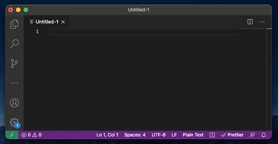

# OpenTextExpander

Simple tool which allows you to define shortcuts for longer texts. For example, if you define short cut 'hi' for text 'hello!', then when you type anywhere word 'hi', program will automatically replace this word with 'hello!'.



## Configuration

Shortcuts should be placed in the ~/ote.ini file.

```
[OTE_WORD_LISTENERS]
hi = Hello! This text is typed from OpenTextExpander :)
bye = See you later!
```